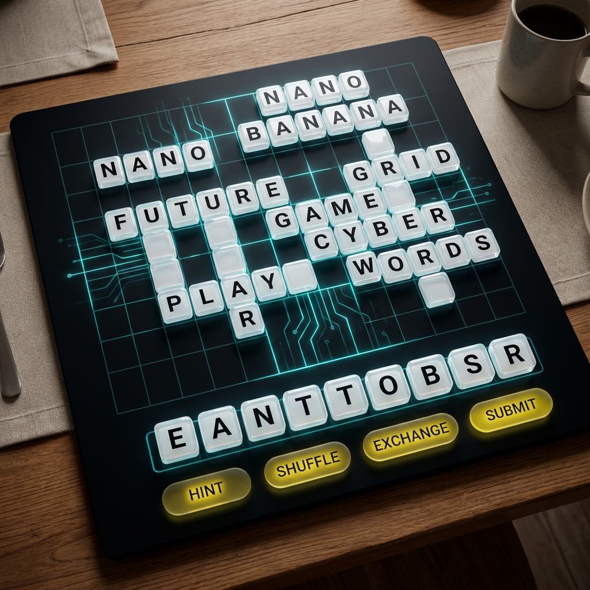
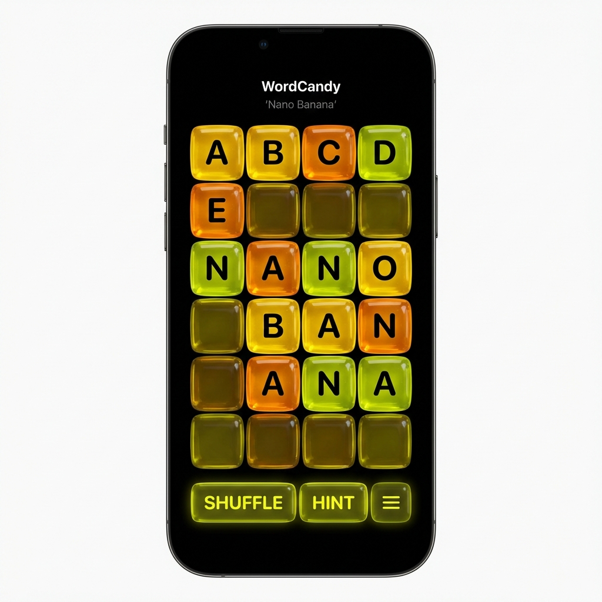
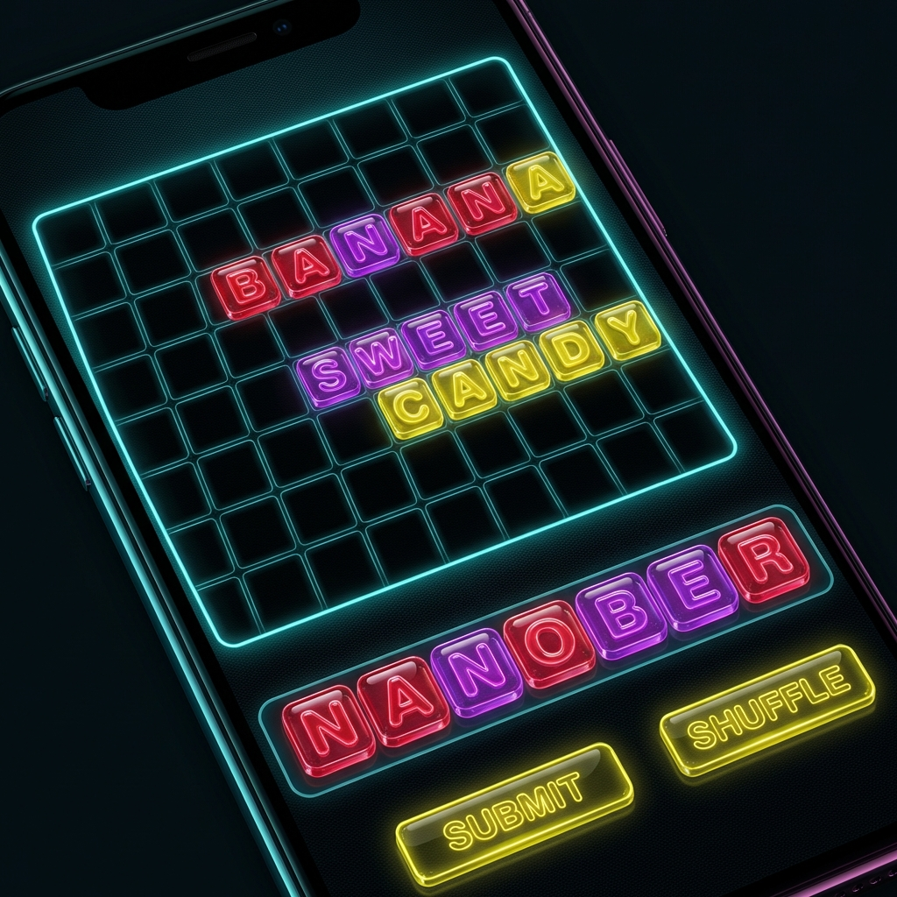

# WordCandy UX Design Specification

## Overview
WordCandy aims to be the sleekest, most premium-feeling word game on the market. We are moving away from the "dusty cardboard" aesthetic of traditional board games and embracing a "Nano Banana" futuristic digital aesthetic.

## Visual Language: "Nano Banana"

### Palette
- **Deep Matte Black (#050505)**: The primary surface. Not pitch black, but deep enough to make colors pop.
- **Banana Yellow (#FFE135)**: Primary action color (Submit, Play). Warm and inviting.
- **Nano Cyan (#00FFCC)**: Secondary accent (Multipliers, Grid Lines, Scores). Electric and cool.
- **Glassmorphism**: Translucent panels with blur for overlays and UI containers.

### The "Candy" Tiles
The most distinct feature of WordCandy is the tiles.
- **Material**: Shiny, translucent acrylic/hard candy.
- **Feel**: Glossy, tactile, appetizing.
- **Typography**: Crisp, high-contrast, sans-serif font printed "inside" the acrylic.

## Concept Gallery

### 1. Board & Grid Overview
The original board concept, showing the ideal grid structure and overall "on the table" feel. Note the faint neon grid lines and empty space for play.

### 2. Tile Aesthetic Detail
A close-up look at the "hard candy" fidelity we want for the tiles. Note the inner glow and tactile jelly-like refraction.

### 3. Mobile Gameplay Target
The definitive gameplay mockup.
- **Density**: 8 tiles across the screen width.
- **Grid**: Clear, empty grid lines (no filler tiles) for unplayed spaces.
- **Rack**: Distinct, floating rack area at the bottom.
- **Controls**: Neon glass buttons below the rack.

## Responsiveness used
- **Mobile First**: The board zooms and pans smoothly.
- **Threlte 3D**: The board is a 3D scene, but locked to functional camera angles (Top-down for play, angled for dramatic wins).
